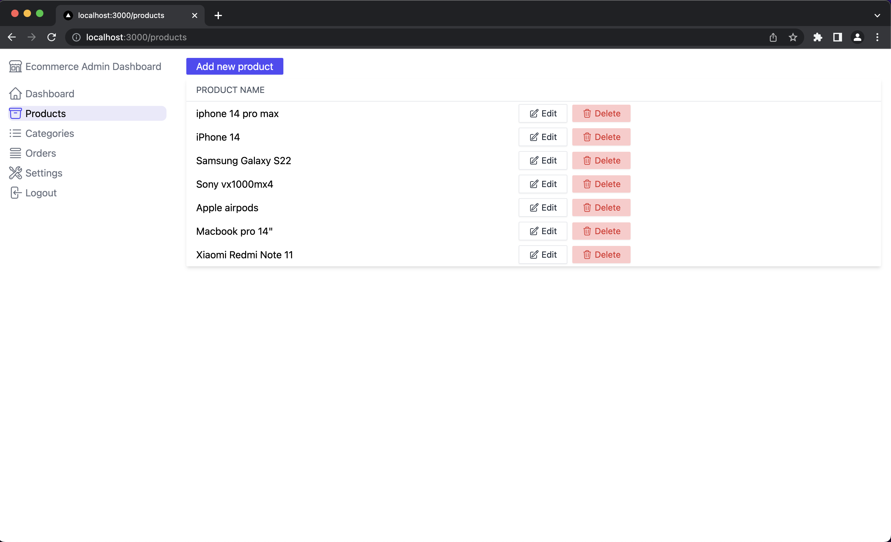
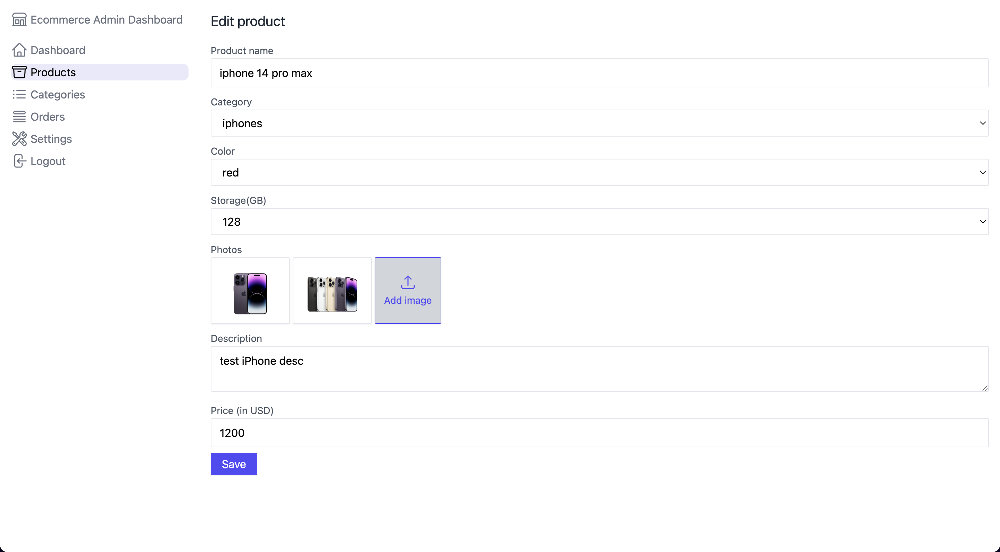
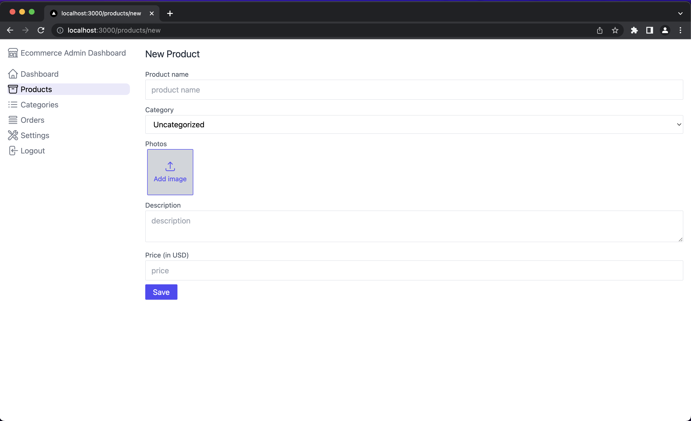
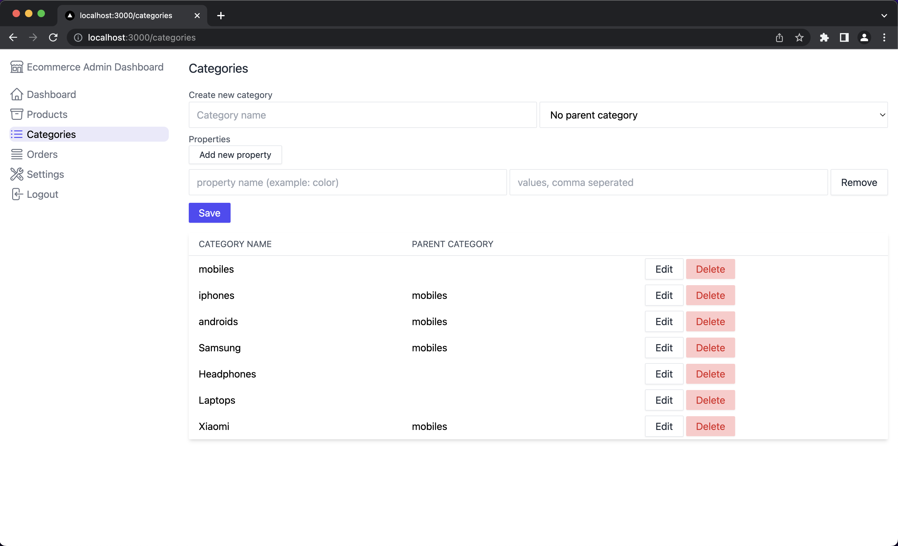
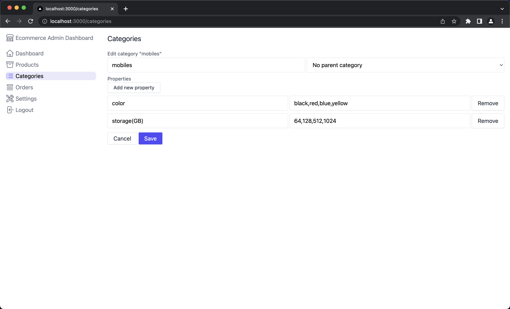
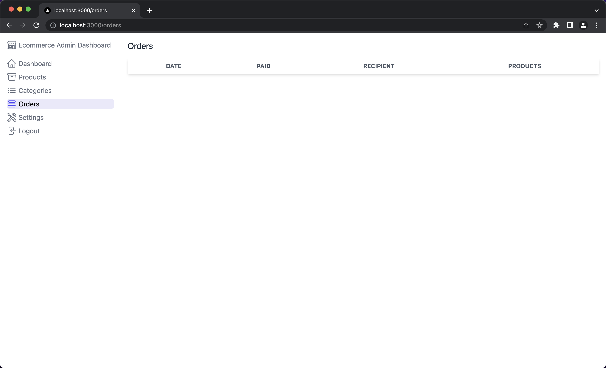

This is a [Next.js](https://nextjs.org/) project bootstrapped with [`create-next-app`](https://github.com/vercel/next.js/tree/canary/packages/create-next-app).

# Admin Dashboard
The Admin Dashboard is a web-based application that allows users to manage products and categories for an e-commerce site. <br />
With this dashboard, you can easily update, add, and delete products and categories, as well as associate products with categories and add characteristics to those products.

## Technologies Used
This project was built using the following technologies:
* Frontend: React
* Backend: Node.js
* Database: MongoDB
* UI Components: Ant Design
* CSS Framework: Tailwind CSS
* AWS: for saveing and hosting the pictures


## Features
The Admin Dashboard includes the following features:
* Product Management: Users can add, update, and delete products, including their photos and associated categories and characteristics.
* Category Management: Users can add, update, and delete categories, as well as associate products with categories.
* Properties Management: Users can add and delete Properties for each category.
* User Authentication: The dashboard requires from the Admin to authenticate with Google account


## Getting Started 

First, run the development server:

```bash
npm run dev

```
## Some preview photos!








Open [http://localhost:3000](http://localhost:3000) with your browser to see the result.

